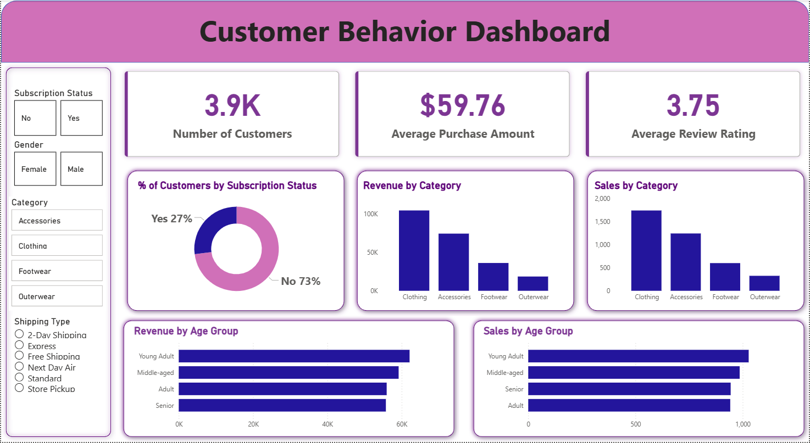

# 🛒 Customer Shopping Behaviour Analysis

A simple end-to-end data analytics project exploring customer demographics, purchasing behaviour, product categories, discounts, payment preferences, and more.  
This project was completed independently using **Python**, **PostgreSQL**, and **Power BI**.

---

## 📌 Project Overview

This project includes:
- Loading and exploring the dataset  
- Cleaning and preprocessing  
- Handling missing values  
- Feature engineering  
- Exporting cleaned data into PostgreSQL  
- Creating an interactive Power BI dashboard  

Dataset size: **3900 rows × 18 columns**

---

## 🧠 Technologies Used
- Python (Pandas, NumPy)
- PostgreSQL
- SQLAlchemy
- Power BI
- Jupyter Notebook

---

## 🐍 Python Workflow (Summary)

- Loaded dataset and inspected structure  
- Fixed missing review ratings using category-wise median  
- Standardized column names  
- Created age-group segmentation  
- Converted purchase frequency labels to numeric days  
- Dropped redundant fields  
- Exported processed dataset into PostgreSQL  

---

## 📊 Power BI Dashboard

The dashboard visualises:
- Category-wise purchases  
- Age group distribution  
- Gender insights  
- Payment method patterns  
- Subscription vs spending  
- Seasonal trends  

### 🔗 **Live Interactive Dashboard (Slicers Enabled)**  
https://app.powerbi.com/view?r=eyJrIjoiOWRlMWNjNmItM2I5MC00OGFmLWIwM2QtNTYyYmQyMDQ2NTEzIiwidCI6IjZlZDBiYjNjLTBmNDQtNDE2NS1iODllLThkN2Q4MGJiNTUyMiJ9

### Dashboard Screenshots  

---

## 📝 Conclusion

This project demonstrates the complete workflow of cleaning, analysing, and visualising customer shopping behaviour.  
The Power BI dashboard provides clear insights into demographics, spending patterns, and shopping habits.

---

## 👤 Author  
**Aditya Nanda**  
B.Tech CSE | AI/ML & Data Analytics
